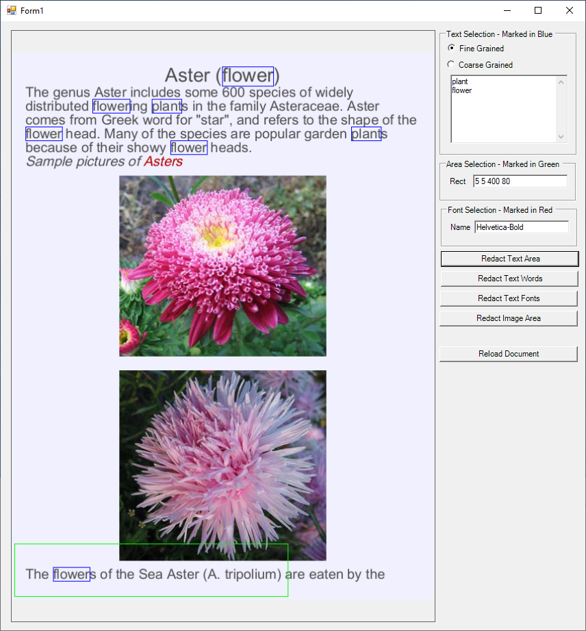

<h1>PDF Redaction</h1>
<h2>.NET Windows Forms project demonstrating how to find and redact text from a PDF.</h2>

This code sample shows how to:

<ul>
<li>Open and display a PDF document</li>
<li>Search for particular words on the page</li>
<li>Search for text in a particular font or style</li>
<li>Search for text in a particular area of the page</li>
<li>Highlight text which has been found</li>
<li>Redact or delete text that has been found</li>
<li>Redact or delete images in a particular area of the page</li>
</ul>

In the screenshot below you can see found words highlighted in blue, selected areas highlighed in green and selected text styles marked up in red. The buttons on the right allow you to select other element of the document and optionally to delete or redact them.

<em>The ABCpdf Team</em>

